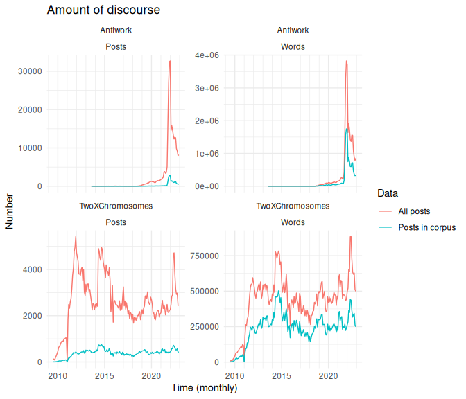
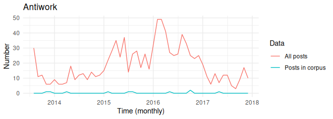
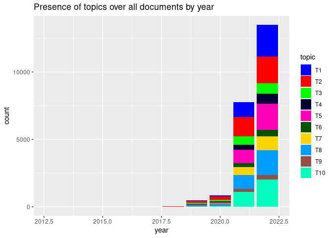
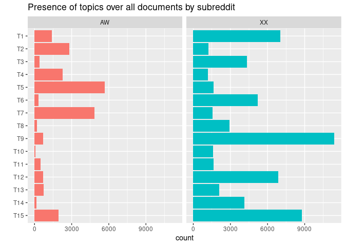
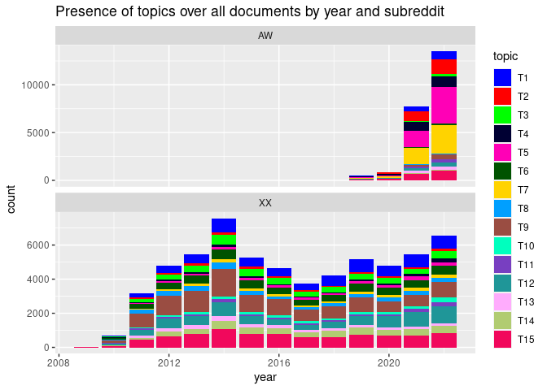
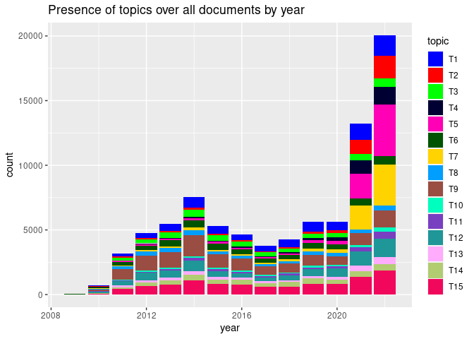
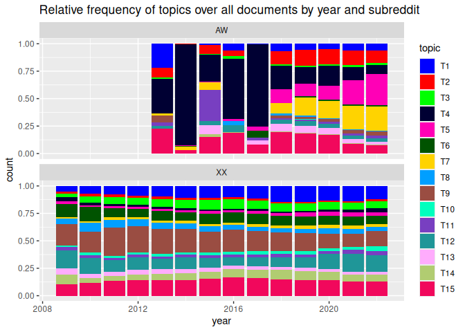

# LDA Topic Models in Posts from Antiwork and TwoXChromosomes


- [Data: All posts, selected posts (\> 350 words), 3 corpora (Antiwork,
  TwoXChromosomes,
  Antiwork+TwoXChromosomes)](#data-all-posts-selected-posts--350-words-3-corpora-antiwork-twoxchromosomes-antiworktwoxchromosomes)
- [10 LDA topic models for each
  corpus](#10-lda-topic-models-for-each-corpus)
- [Subreddit Identity Topics](#subreddit-identity-topics)
  - [Antiwork](#antiwork)
  - [TwoXChromosomes](#twoxchromosomes)
- [Antiwork LDA 10](#antiwork-lda-10)
- [TwoXChromosomes LDA 10](#twoxchromosomes-lda-10)
- [Antiwork+TwoXChromosomes LDA 4: Topics and
  documents](#antiworktwoxchromosomes-lda-4-topics-and-documents)
- [Appendix](#appendix)
  - [Perplexity and log-likelihood per word for all LDA
    models](#perplexity-and-log-likelihood-per-word-for-all-lda-models)

[](https://doi.org/10.5281/zenodo.14849759)

## Data: All posts, selected posts (\> 350 words), 3 corpora (Antiwork, TwoXChromosomes, Antiwork+TwoXChromosomes)

All posts from the subreddits
[Antiwork](https://www.reddit.com/r/antiwork/) and
[TwoXChromosomes](https://www.reddit.com/r/TwoXChromosomes/) have been
collected using the data dumps of pushshift in 2023. This includes post
from the very beginning of the subreddits until the end of 2022.

For both data sets we then selected relevant variables, in particular
the `title` string and the `selftext` string which is the post’s text.
We joined both strings into one string and counted the words. Then we
selected only those posts where title and text together have more than
350 words (additionally posts should not be marked as removed from
reddit in the dataset). The strings in these texts where then used to
construct a corpus for the topic models. (That means we tokenized the
text and removed stop words with a slighlty customized selection of
words as documented in the script `tomotopy_create_corpus.py`.)

For **Antiwork** there were 292.352 posts in the raw data. 132.617 of
these have a non-empty selftext. Combining title and selftext **22.629**
posts have more than 350 words and build the documents in the Antiwork
corpus. The number of words of the texts in the documents of the corpus
range from 351 to 7875 (with mean 629.4 and median 520 words).

For **TwoXChromosomes** there were 420.486 posts in the raw data.
239.744 of these have a non-empty selftext. Combining title and selftext
**61.601** posts have more than 350 words and build the documents in the
TwoXChromosomes corpus. The number of words of the texts in the
documents of the corpus range from 351 to 7263 (with mean 613.4 and
median 501 words).

Number of posts and words in Antiwork and TwoXChromosomes:



The number of posts in Antiwork before 2018 is quite low. Only
occasionally one per month ended up in our corpus:



Finally we combined the two corpora into one corpus
**Antiwork+TwoXChromosomes** with **84.230** documents.

The Antiwork corpus has a vocabulary of 26.704 words, the
TwoXChromosomes corpus has a vocabulary of 37.322 words and the combined
corpus has a vocabulary of 44.649 words.

## 10 LDA topic models for each corpus

We have created 10 topic models for each corpus (Antiwork,
TwoXChromosomes and Antiwork+TwoXChromosomes) using the LDA model
estimated with `tomotopy`. For the Antiwork and the TwoXChromosomes
corpus we estimated LDAs with 10 topics. For the combined corpus we
estimated LDAs with 15 topics.

The following table shows the links to the visualizations of the topics
of all LDAs constructed with `pyLDAvis`. The visualizations are
interactive and allow to explore the topics and the words in the topics.
There is a parameter $\lambda$ which can be adjusted to show the words
of the topics arranged by the most common words in the topic
($\lambda = 1$), by the most common words as a fraction of their
appearance in the whole corpus ($\lambda = 0$) or a mix between the two.
The links below show the topic’s words with $\lambda = 0.5$.

| Antiwork LDAs | TwoXChromosomes LDAs | Antiwork+TwoXChromosomes LDAs |
|----|----|----|
| [Antiwork 1](https://janlorenz.github.io/TopicModels_XX_Antiwork/AWl1.html#topic=0&lambda=0.5&term=) | [TwoXChromosomes 1](https://janlorenz.github.io/TopicModels_XX_Antiwork/XXl1.html#topic=0&lambda=0.5&term=) | [Antiwork+TwoXChromosomes 1](https://janlorenz.github.io/TopicModels_XX_Antiwork/XXAW151.html#topic=0&lambda=0.5&term=) |
| [Antiwork 2](https://janlorenz.github.io/TopicModels_XX_Antiwork/AWl2.html#topic=0&lambda=0.5&term=) | [TwoXChromosomes 2](https://janlorenz.github.io/TopicModels_XX_Antiwork/XXl2.html#topic=0&lambda=0.5&term=) | [Antiwork+TwoXChromosomes 2](https://janlorenz.github.io/TopicModels_XX_Antiwork/XXAW152.html#topic=0&lambda=0.5&term=) |
| [Antiwork 3](https://janlorenz.github.io/TopicModels_XX_Antiwork/AWl3.html#topic=0&lambda=0.5&term=) | [TwoXChromosomes 3](https://janlorenz.github.io/TopicModels_XX_Antiwork/XXl3.html#topic=0&lambda=0.5&term=) | [Antiwork+TwoXChromosomes 3](https://janlorenz.github.io/TopicModels_XX_Antiwork/XXAW153.html#topic=0&lambda=0.5&term=) |
| [Antiwork 4](https://janlorenz.github.io/TopicModels_XX_Antiwork/AWl4.html#topic=0&lambda=0.5&term=) | [TwoXChromosomes 4](https://janlorenz.github.io/TopicModels_XX_Antiwork/XXl4.html#topic=0&lambda=0.5&term=) | [**Antiwork+TwoXChromosomes 4**](https://janlorenz.github.io/TopicModels_XX_Antiwork/XXAW154.html#topic=0&lambda=0.5&term=) |
| [Antiwork 5](https://janlorenz.github.io/TopicModels_XX_Antiwork/AWl5.html#topic=0&lambda=0.5&term=) | [**TwoXChromosomes 5**](https://janlorenz.github.io/TopicModels_XX_Antiwork/XXl5.html#topic=0&lambda=0.5&term=) | [Antiwork+TwoXChromosomes 5](https://janlorenz.github.io/TopicModels_XX_Antiwork/XXAW155.html#topic=0&lambda=0.5&term=) |
| [Antiwork 6](https://janlorenz.github.io/TopicModels_XX_Antiwork/AWl6.html#topic=0&lambda=0.5&term=) | [TwoXChromosomes 6](https://janlorenz.github.io/TopicModels_XX_Antiwork/XXl6.html#topic=0&lambda=0.5&term=) | [Antiwork+TwoXChromosomes 6](https://janlorenz.github.io/TopicModels_XX_Antiwork/XXAW156.html#topic=0&lambda=0.5&term=) |
| [Antiwork 7](https://janlorenz.github.io/TopicModels_XX_Antiwork/AWl7.html#topic=0&lambda=0.5&term=) | [TwoXChromosomes 7](https://janlorenz.github.io/TopicModels_XX_Antiwork/XXl7.html#topic=0&lambda=0.5&term=) | [Antiwork+TwoXChromosomes 7](https://janlorenz.github.io/TopicModels_XX_Antiwork/XXAW157.html#topic=0&lambda=0.5&term=) |
| [Antiwork 8](https://janlorenz.github.io/TopicModels_XX_Antiwork/AWl8.html#topic=0&lambda=0.5&term=) | [TwoXChromosomes 8](https://janlorenz.github.io/TopicModels_XX_Antiwork/XXl8.html#topic=0&lambda=0.5&term=) | [Antiwork+TwoXChromosomes 8](https://janlorenz.github.io/TopicModels_XX_Antiwork/XXAW158.html#topic=0&lambda=0.5&term=) |
| [Antiwork 9](https://janlorenz.github.io/TopicModels_XX_Antiwork/AWl9.html#topic=0&lambda=0.5&term=) | [TwoXChromosomes 9](https://janlorenz.github.io/TopicModels_XX_Antiwork/XXl9.html#topic=0&lambda=0.5&term=) | [Antiwork+TwoXChromosomes 9](https://janlorenz.github.io/TopicModels_XX_Antiwork/XXAW159.html#topic=0&lambda=0.5&term=) |
| [**Antiwork 10**](https://janlorenz.github.io/TopicModels_XX_Antiwork/AWl10.html#topic=0&lambda=0.5&term=) | [TwoXChromosomes 10](https://janlorenz.github.io/TopicModels_XX_Antiwork/XXl10.html#topic=0&lambda=0.5&term=) | [Antiwork+TwoXChromosomes 10](https://janlorenz.github.io/TopicModels_XX_Antiwork/XXAW1510.html#topic=0&lambda=0.5&term=) |

For each LDA perplexity scores and log-likelihood per word are
calculated. The numbers are shown in a table in the Appendix below. The
lower the perplexity and the higher the log-likelihood per word, the
better the model. Based on these numbers we can select the best fitting
LDA for each corpus. Consistently between the two measures, the best
fitting LDA for Antiwork is 10, for TwoXChromosomes it is 5, and for
Antiwork+TwoXChromosomes 4. Those are highlighted in the table above and
used as the main reference in the following.

The others LDAs serve to assess the robustness of the results because
LDAs tend to not be converging to exactly the same solution when run
again.

## Subreddit Identity Topics

For both subreddits one topic can be interpreted as the subreddit
identity topic.

### Antiwork

[Antiwork LDA 10, Topic
3](https://janlorenz.github.io/TopicModels_XX_Antiwork/AWl10.html#topic=3&lambda=0.5&term=)  
is about “we” “our” “us” “workers” “society” as top words and also has
the words “strike” “capitalism” “movement” and others in it. It is also
the topic with the word “we” scoring highest and by the context this
seems to relate to a collective “we” of the subreddit or a community
transcending it.

The Antiwork identity topic appears very similar as
[Antiwork+TwoXChromosomes 4, Topic
4](https://janlorenz.github.io/TopicModels_XX_Antiwork/XXAW154.html#topic=4&lambda=0.5&term=)

### TwoXChromosomes

[TwoXChromosomes LDA 5, Topic
6](https://janlorenz.github.io/TopicModels_XX_Antiwork/XXl5.html#topic=6&lambda=0.5&term=)  
is about “women” “men” “woman” “people” “male” as top words and also has
the words “feminism” “sexism” “trans” and others in it. The word “we” is
not in the top words (although it is also not marginal in the topic).
This is because other topics have the word “we” in it but these are the
topics about family and relationships where the context of the “we”
indicates that “we” relates to family or the relationship and not to a
group identity of the subreddit.

The TwoXChromosomes identity topic appears very similar in
[Antiwork+TwoXChromosomes 4, Topic
12](https://janlorenz.github.io/TopicModels_XX_Antiwork/XXAW154.html#topic=12&lambda=0.5&term=)

## Antiwork LDA 10



## TwoXChromosomes LDA 10


## Antiwork+TwoXChromosomes LDA 4: Topics and documents

Most topics are typical for one of the subreddits. (All this is for LDA
4.)



``` r
doc_topic <- XXAW15_LDAs$doc_topic_dists[[4]]
XXAW_top <- XXAW |> bind_cols(doc_topic)
XXAW_top |> group_by(subreddit) |> summarise(across(paste0("T", 1:15), sum)) |> 
 pivot_longer(cols = -subreddit, names_to = "topic", values_to = "count") |> 
 mutate(Fraction = count/sum(count), .by = subreddit) |> 
 ggplot(aes(y=factor(topic, levels = paste0("T", 1:15)) |> fct_rev(), x=Fraction, fill=subreddit)) + 
 geom_col(position = 'dodge') +
 labs(y = "", title = "Presence of topics over all documents by subreddit as percentage in subreddit") + 
 guides(fill = "none")
```



There are only two topics which appear more or less equally often in
both subreddits: Topic 13, about school time (roughly 3%) and topic 11
about police (roughly 2.5%). The clearly antiwork dominated topics are
2, 4, 5 and 7. The other topics are XX dominated: 1, 3, 6, 8, 9, 10, 12,
14, and 15.




    `summarise()` has grouped output by 'year'. You can override using the
    `.groups` argument.


    `summarise()` has grouped output by 'year'. You can override using the
    `.groups` argument.



## Appendix

### Perplexity and log-likelihood per word for all LDA models

| LDA                | Perplexity | Log-likelihood per word |
|:-------------------|-----------:|------------------------:|
| Antiwork 1         |   6004.324 |               -8.700235 |
| Antiwork 2         |   6034.415 |               -8.705234 |
| Antiwork 3         |   5989.324 |               -8.697734 |
| Antiwork 4         |   6037.625 |               -8.705766 |
| Antiwork 5         |   6026.343 |               -8.703896 |
| Antiwork 6         |   6033.344 |               -8.705057 |
| Antiwork 7         |   6052.660 |               -8.708253 |
| Antiwork 8         |   6009.007 |               -8.701015 |
| Antiwork 9         |   5952.494 |               -8.691566 |
| Antiwork 10        |   5917.345 |               -8.685643 |
| TwoXChromosomes 1  |   5902.384 |               -8.683112 |
| TwoXChromosomes 2  |   5863.708 |               -8.676537 |
| TwoXChromosomes 3  |   5910.039 |               -8.684408 |
| TwoXChromosomes 4  |   5976.158 |               -8.695533 |
| TwoXChromosomes 5  |   5827.158 |               -8.670285 |
| TwoXChromosomes 6  |   5856.752 |               -8.675351 |
| TwoXChromosomes 7  |   5855.450 |               -8.675128 |
| TwoXChromosomes 8  |   5857.814 |               -8.675532 |
| TwoXChromosomes 9  |   5830.822 |               -8.670913 |
| TwoXChromosomes 10 |   5889.506 |               -8.680927 |
| XXAW151            |   6401.640 |               -8.764309 |
| XXAW152            |   6496.871 |               -8.779076 |
| XXAW153            |   6388.455 |               -8.762248 |
| XXAW154            |   6290.604 |               -8.746812 |
| XXAW155            |   6394.564 |               -8.763203 |
| XXAW156            |   6402.499 |               -8.764444 |
| XXAW157            |   6425.186 |               -8.767981 |
| XXAW158            |   6421.309 |               -8.767377 |
| XXAW159            |   6378.506 |               -8.760689 |
| XXAW1510           |   6412.032 |               -8.765932 |
