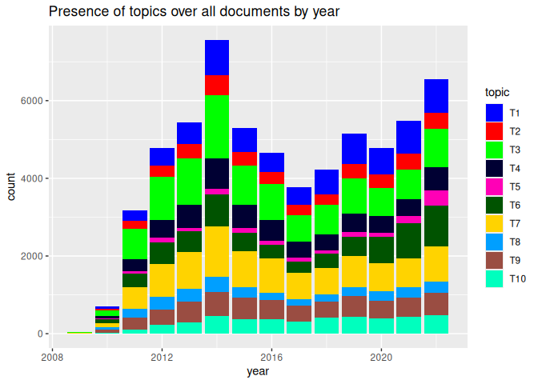
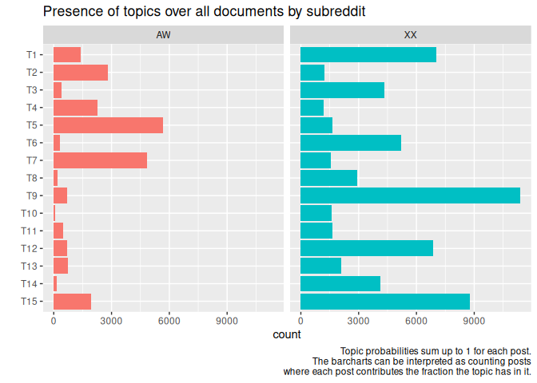
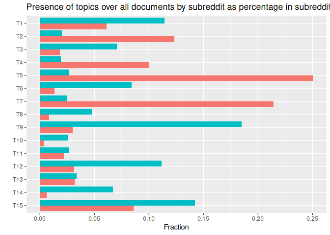

# README


## Data

From the collected posts from the subreddits antiwork and
twoXchromosomes, we have created a joining both subreddits and the posts
with more than 350 words. The data is stored in the parquet file
`XXAW.parquet`. These are counts of posts from each subreddit with more
than 350 words.

``` r
XXAW |> count(subreddit) |> kable()
```

| subreddit |     n |
|:----------|------:|
| AW        | 22629 |
| XX        | 61601 |

## 10 topic models

We have created 10 topic models using the LDA model estimated with
`tomotopy`.

The models are stored in the `data` folder. The models are named
`XXAW151`, `XXAW152`, …, `XXAW1510`. The LDAVis can be accessed

[XXAW151](https://janlorenz.github.io/TopicModels_XX_Antiwork/XXAW151.html)  
[XXAW152](https://janlorenz.github.io/TopicModels_XX_Antiwork/XXAW152.html)  
[XXAW153](https://janlorenz.github.io/TopicModels_XX_Antiwork/XXAW153.html)  
[**XXAW154**](https://janlorenz.github.io/TopicModels_XX_Antiwork/XXAW154.html)  
[XXAW155](https://janlorenz.github.io/TopicModels_XX_Antiwork/XXAW155.html)  
[XXAW156](https://janlorenz.github.io/TopicModels_XX_Antiwork/XXAW156.html)  
[XXAW157](https://janlorenz.github.io/TopicModels_XX_Antiwork/XXAW157.html)  
[XXAW158](https://janlorenz.github.io/TopicModels_XX_Antiwork/XXAW158.html)  
[XXAW159](https://janlorenz.github.io/TopicModels_XX_Antiwork/XXAW159.html)  
[XXAW1510](https://janlorenz.github.io/TopicModels_XX_Antiwork/XXAW1510.html)

## Model assessment

This table shows two metrics for each of the 10 models: perplexity and
log-likelihood per word. The lower the perplexity and the higher the
log-likelihood per word, the better the model.

``` r
XXAW15_LDAs |> select(id, perplexity, ll_per_word) |> kable()
```

| id       | perplexity | ll_per_word |
|:---------|-----------:|------------:|
| XXAW151  |   6401.640 |   -8.764309 |
| XXAW152  |   6496.871 |   -8.779076 |
| XXAW153  |   6388.455 |   -8.762248 |
| XXAW154  |   6290.604 |   -8.746812 |
| XXAW155  |   6394.564 |   -8.763203 |
| XXAW156  |   6402.499 |   -8.764444 |
| XXAW157  |   6425.186 |   -8.767981 |
| XXAW158  |   6421.309 |   -8.767377 |
| XXAW159  |   6378.506 |   -8.760689 |
| XXAW1510 |   6412.032 |   -8.765932 |

In conclusion, we focus in the following on **LDA 4** as the best model
in both measures. In the following we assess which topics appear
similarly in the other estimated LDAs.

… TODO

So, many of the topics in LDA 4 have a one-to-one correspondence with
topics in many other LDAs. Typically 13 out of 15 topics from LDA4
appear in each other LDA (not always the same) as a clear one-to-one
correspondance. Over all other 9 LDA all topics in the majority of these
9 LDAs as a one-to-one correspondance with the topic in LDA4, often in 8
or 9 out of nine.

## Topics and documents

Most topics are typical for one of the subreddits. (All this is for LDA
4.)

``` r
doc_topic <- XXAW15_LDAs$doc_topic_dists[[4]]
XXAW_top <- XXAW |> bind_cols(doc_topic)
XXAW_top |> group_by(subreddit) |> summarise(across(paste0("T", 1:15), sum)) |> 
 pivot_longer(cols = -subreddit, names_to = "topic", values_to = "count") |> 
 ggplot(aes(y=factor(topic, levels = paste0("T", 1:15)) |> fct_rev(), x=count, fill=subreddit)) + 
 geom_col(position = "stack") +
 facet_wrap(~subreddit) + labs(y = "", title = "Presence of topics over all documents by subreddit") + 
 guides(fill = "none")
```


``` r
XXAW_top |> mutate(year = year(created_time)) |> 
 group_by(year) |> summarise(across(paste0("T", 1:15), sum)) |> 
 pivot_longer(cols = paste0("T", 1:15), names_to = "topic", values_to = "count") |>
 mutate(topic = factor(topic, levels = paste0("T", 1:15))) |> 
 ggplot(aes(x = year, y = count, fill=topic)) + 
 geom_col(position = "stack") +
 scale_fill_manual(values = pals::glasbey(15)) +
 labs(title = "Presence of topics over all documents by year")
```



``` r
XXAW_top |> mutate(year = year(created_time)) |> 
 group_by(year) |> summarise(across(paste0("T", 1:15), mean)) |> 
 pivot_longer(cols = paste0("T", 1:15), names_to = "topic", values_to = "count") |>
 mutate(topic = factor(topic, levels = paste0("T", 1:15))) |> 
 ggplot(aes(x = year, y = count, fill=topic)) + 
 geom_col(position = "stack") +
 scale_fill_manual(values = pals::glasbey(15)) +
 labs(title = "Relative frequency of topics over all documents by year")
```



``` r
XXAW_top |> mutate(year = year(created_time)) |> 
 group_by(year,subreddit) |> summarise(across(paste0("T", 1:15), sum)) |> 
 pivot_longer(cols = paste0("T", 1:15), names_to = "topic", values_to = "count") |>
 mutate(topic = factor(topic, levels = paste0("T", 1:15))) |> 
 ggplot(aes(x = year, y = count, fill=topic)) + 
 geom_col(position = "stack") +
 facet_wrap(~subreddit, ncol = 1, scales = "free_y") +
 scale_fill_manual(values = pals::glasbey(15)) +
 labs(title = "Presence of topics over all documents by year and subreddit")
```

    `summarise()` has grouped output by 'year'. You can override using the
    `.groups` argument.



``` r
XXAW_top |> mutate(year = year(created_time)) |> 
 group_by(year,subreddit) |> summarise(across(paste0("T", 1:15), mean)) |> 
 pivot_longer(cols = paste0("T", 1:15), names_to = "topic", values_to = "count") |>
 mutate(topic = factor(topic, levels = paste0("T", 1:15))) |> 
 ggplot(aes(x = year, y = count, fill=topic)) + 
 geom_col(position = "stack") +
 facet_wrap(~subreddit, ncol = 1, scales = "free_y") +
 scale_fill_manual(values = pals::glasbey(15)) +
 labs(title = "Relative frequency of topics over all documents by year and subreddit")
```

    `summarise()` has grouped output by 'year'. You can override using the
    `.groups` argument.


## Users

All users with more than 10 posts in the dataset are shown below.

``` r
XXAW |> count(subreddit, author, sort = TRUE)  |> filter(n > 10) |> arrange(subreddit) |> kable()
```

| subreddit | author               |     n |
|:----------|:---------------------|------:|
| AW        | \[deleted\]          |   649 |
| AW        | *Raspootin*          |    39 |
| AW        | Nickzreg             |    25 |
| AW        | capnbarky            |    22 |
| AW        | Send_Me_Bee_Stuff    |    16 |
| AW        | BadassPlaya2517      |    15 |
| AW        | ournextarc           |    13 |
| AW        | Waja_wurr90          |    12 |
| AW        | Wilsthing1988        |    11 |
| AW        | jcrosse1917          |    11 |
| AW        | nobodynewknew        |    11 |
| XX        | \[deleted\]          | 10386 |
| XX        | AceZeroXYZ           |    40 |
| XX        | carlinha1289         |    31 |
| XX        | Help_Me_Reddit01     |    29 |
| XX        | Murtlepos            |    27 |
| XX        | Lionoras             |    24 |
| XX        | shygirlturnedsassy   |    20 |
| XX        | superpony123         |    20 |
| XX        | MagzalaAstrallis     |    19 |
| XX        | bunnydigs            |    19 |
| XX        | throwaway99111123    |    18 |
| XX        | Franchesca8899       |    17 |
| XX        | PinkGreyGirl         |    17 |
| XX        | rejs7                |    17 |
| XX        | MisogynyisaDisease   |    16 |
| XX        | SilverScreen2019     |    16 |
| XX        | zazzlekdazzle        |    16 |
| XX        | Crystal_wolf04       |    15 |
| XX        | newprofilewhodis1352 |    15 |
| XX        | Some-call-me-ada     |    14 |
| XX        | Bluellan             |    13 |
| XX        | PurpleFlame8         |    13 |
| XX        | VisionsOfLife        |    13 |
| XX        | catniagara           |    13 |
| XX        | depressedkittyfr     |    13 |
| XX        | irishtrashpanda      |    13 |
| XX        | lil_staal            |    13 |
| XX        | Easteuroblondie      |    12 |
| XX        | ScrumptiousCookie123 |    12 |
| XX        | callmekanga          |    12 |
| XX        | tama_gotchi          |    12 |
| XX        | Soft_Reference_6490  |    11 |
| XX        | monieo               |    11 |

These are users who posted in both subreddits. Shown are the twenty
users with most posts in both subreddits.

``` r
XXusers <- XXAW |> filter(subreddit == "XX") |> count(author, name = "XX_n") 
AWusers <- XXAW |> filter(subreddit == "AW")  |> count(author, name = "AW_n")
XXusers |> inner_join(AWusers, by = "author") |> arrange(desc(XX_n + AW_n)) |> write_csv("XXAWusers.csv")
XXusers |> inner_join(AWusers, by = "author") |> arrange(desc(XX_n + AW_n)) |> head(20) |> kable()
```

| author               |  XX_n | AW_n |
|:---------------------|------:|-----:|
| \[deleted\]          | 10386 |  649 |
| newprofilewhodis1352 |    15 |    4 |
| catniagara           |    13 |    3 |
| tempted_temptress    |     9 |    6 |
| Easteuroblondie      |    12 |    2 |
| Minute-Jello-1919    |     1 |    9 |
| CurrentSingleStatus  |     5 |    4 |
| Delta4o              |     6 |    3 |
| Marblue              |     8 |    1 |
| annieduty            |     2 |    7 |
| braveguppy           |     5 |    3 |
| copper_rainbows      |     7 |    1 |
| krazyforlove         |     7 |    1 |
| BakerLovePie         |     6 |    1 |
| Larry-Man            |     6 |    1 |
| LongNectarine3       |     6 |    1 |
| Petallic             |     4 |    3 |
| super_soprano13      |     6 |    1 |
| EQOA_Fanatic         |     1 |    5 |
| MandrakeThePancake   |     5 |    1 |

``` r
AceZeroXYZ <- XXAW_top |> filter(author == "AceZeroXYZ") |> 
 select(subreddit, created_time, created_day, url, title, url, num_comments, score, 
        T1, T2, T3, T4, T5, T6, T7, T8, T9, T10, T11, T12, T13, T14, T15, selftext) 
write_csv(AceZeroXYZ, "data/AceZeroXYZ.csv")
```
